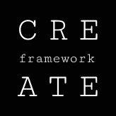

# 🚀 CREATE: An AI-Powered Framework for Web Product Development

**CREATE** is a versatile, flexible methodology that turns a chaotic idea into a profitable and scalable web service.

🌐 **Choose your language:**
- [Русский](README.md)
- [English](README_en.md)

---

The framework is designed for teams aiming for **fast iteration** and wanting to use AI platforms to transform an idea into a product with minimal time and financial costs.

  
  <h3>`C` - Context</h3>
  <h3>`R` - Research</h3>
  <h3>`E` - Elaboration</h3>
  <h3>`A` - Assembly</h3>
  <h3>`T` - Tuning</h3>
  <h3>`E` - Expansion</h3>

## ✨ Core Principles

-   **AI-Driven**: AI acts not just as a tool but as a full-fledged partner at every stage of development, from market analysis to business metric optimization.
-   **Fast Iteration**: We believe in quickly testing hypotheses using No-Code and AI tools to find a working idea before investing resources in full-scale development.
-   **Community-Powered**: The framework is a living organism that is constantly evolving. We, like you, are a team of enthusiasts who are constantly looking for new ways to apply AI in product development. Your suggestions, edits, and new ideas for prompts are what will allow our framework to grow and adapt to the ever-changing world of technology.

## 🛠️ How it Works

The framework consists of six sequential yet flexible stages, each with its own goal and set of prompts for an AI assistant:

1.  **[C - Context](docs/en/C-Context.md)**: Define the emotional core of the product and its fundamental idea.
2.  **[R - Research](docs/en/R-Research.md)**: Shift from intuition to data.
3.  **[E - Elaboration](docs/en/E-Elaboration.md)**: Rapidly test hypotheses with AI and No-Code tools.
4.  **[A - Assembly](docs/en/A-Assembly.md)**: Build a scalable product by assembling all the ready-made components.
5.  **[T - Tuning](docs/en/T-Tuning.md)**: Validate the product and find growth opportunities.
6.  **[E - Expansion](docs/en/E-Expansion.md)**: Scale the product and business, making AI a strategic partner.

## 🤝 Contributing

We are open to all suggestions and improvements. If you have ideas for improving prompts, new prompts, or suggestions for the structure, please read our guide on how to contribute: **[CONTRIBUTING.md](CONTRIBUTING.md)**.

Let's build the future of product development together!
