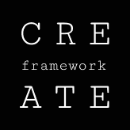

# 🚀 CREATE: Фреймворк для разработки WEB продуктов с использованием AI

**CREATE** — это универсальная, гибкая методология, которая превращает хаотичную идею в прибыльный и масштабируемый веб-сервис.

🌐 **Choose your language:**
- [Русский](README_ru.md)
- [English](README.md)

---

Фреймворк разработан для команд, которые стремятся к **быстрой итерации** и хотят использовать AI-платформы, чтобы превратить идею в продукт с минимальными временными и финансовыми затратами.

## Общее описание методологии

CREATE — это не просто набор промптов, а целостная методология, которая превращает хаотичную идею в прибыльный и масштабируемый веб-сервис, используя искусственный интеллект как центральный инструмент. Она была создана для решения одной из главных проблем при работе с большими языковыми моделями (LLM): потеря контекста.

Нейросети, особенно при выполнении сложных и многоэтапных задач, часто работают "в моменте". Они могут генерировать блестящий текст или код для одного промпта, но забыть детали и нюансы, которые были упомянуты в предыдущем. Это приводит к фрагментации, потере логики и, как следствие, к созданию несвязных, нежизнеспособных "артефактов" вместо целостного продукта.

CREATE решает эту проблему, превращая процесс в единую, последовательную цепь. Это своего рода нить продуктовой стратегии, на которую мы нанизываем бусины из артефактов. Каждая «бусина» — это результат работы над одним из этапов фреймворка (например, миссия, ценности, анализ конкурентов). Самое важное, что каждый последующий промпт использует результаты предыдущего в качестве своих входных данных. Таким образом, AI-модель постоянно «помнит» весь накопленный контекст, и каждый новый шаг органично вытекает из предыдущего.

  
  <h3>`C` - Context</h3>
  <h3>`R` - Research</h3>
  <h3>`E` - Elaboration</h3>
  <h3>`A` - Assembly</h3>
  <h3>`T` - Tuning</h3>
  <h3>`E` - Expansion</h3>

## ✨ Основные принципы

- **AI-Driven**: AI выступает не просто как инструмент, а как полноценный партнер на каждом этапе разработки, от анализа рынка до оптимизации бизнес-метрик.
- **Fast Iteration**: Мы верим в быструю проверку гипотез, используя No-Code и AI-инструменты, чтобы найти рабочую идею до того, как тратить ресурсы на полноценную разработку.
- **Community-Powered**: Фреймворк — это живой организм, который постоянно развивается. Мы, как и вы, — команда энтузиастов, которые постоянно ищут новые способы применения AI в разработке продуктов. Ваши предложения, правки и новые идеи для промптов — это то, что позволит нашему фреймворку расти и адаптироваться к постоянно меняющемуся миру технологий.

## 🛠️ Как это работает?

Фреймворк состоит из шести последовательных, но гибких этапов, каждая из которых имеет свою цель и набор промптов для AI-ассистента:

1.  **[C - Context](docs/ru/C-Context.md)**: Определить эмоциональное ядро продукта и его фундаментальную идею.
2.  **[R - Research](docs/ru/R-Research.md)**: Переключиться с интуиции на данные.
3.  **[E - Elaboration](docs/ru/E-Elaboration.md)**: Быстро тестировать гипотезы с помощью AI и No-Code инструментов.
4.  **[A - Assembly](docs/ru/A-Assembly.md)**: Построить масштабируемый продукт, собрав все готовые компоненты.
5.  **[T - Tuning](docs/ru/T-Tuning.md)**: Валидировать продукт и найти точки роста.
6.  **[E - Expansion](docs/ru/E-Expansion.md)**: Масштабировать продукт и бизнес, делая AI стратегическим партнером.

## 🤝 Вклад в проект

Мы открыты для любых предложений и улучшений. Если у вас есть идеи по улучшению промптов, новые промпты или предложения по структуре, пожалуйста, ознакомьтесь с нашим гайдом по внесению вклада в проект: **[CONTRIBUTING.md](CONTRIBUTING.md)**.

Давайте создавать будущее продуктовой разработки вместе!

## Благодарности

Огромное спасибо всем, кто помог этому проекту! Особая благодарность:

- **Евгений Леонтьев**  за поддержку и терпение.

